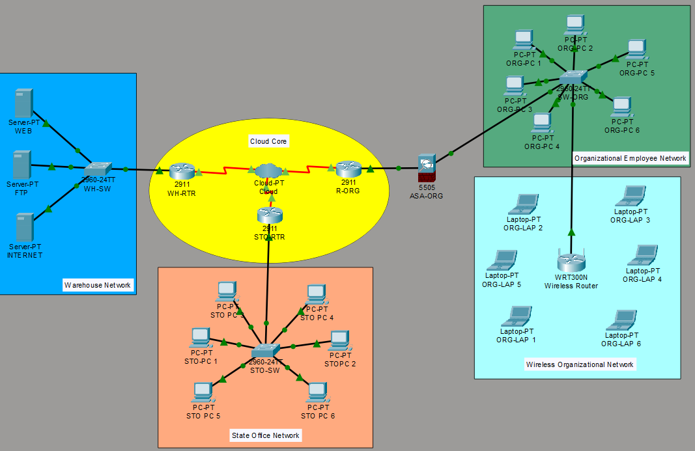

# Networking in the Cloud (ZEDAN Enterprises)

**Author:** Sahil Faraz | **Date:** June 2025

---

## 📋 Project Overview

This repository contains the Cisco Packet Tracer network simulations developed for a **Networking in the Cloud** assignment which included *Principles, Implementation, and Performance Enhancement*. It demonstrates the design, implementation, testing, and optimization of a multi-site enterprise cloud network. The network spans three physical zones interconnected over a Frame Relay WAN, secured with Cisco ASA firewalls, and validated through performance and scalability testing. Two iterations are included — a base implementation and an optimized version with NAT, redundancy, and IoT integration.

> Simulated in **Cisco Packet Tracer 8.x** | Part of HND Digital Technologies (Cybersecurity) — Unit 6: Networking in the Cloud

---

## Table of Contents

- [Architecture Overview](#architecture-overview)
- [Network Zones](#network-zones)
- [IP Addressing](#ip-addressing)
- [WAN Design — Frame Relay](#wan-design--frame-relay)
- [Routing](#routing)
- [Security — ASA Firewalls](#security--asa-firewalls)
- [Base vs Optimized](#base-vs-optimized)
- [Performance Testing](#performance-testing)
- [Repository Structure](#repository-structure)
- [How to Use](#how-to-use)
- [Tools](#tools)

---

## Architecture Overview

The network follows a **three-zone segmentation model** representing a warehouse hosting core services, an organizational headquarters, and a remote state office. All three zones are connected over a simulated Frame Relay WAN cloud. Each zone has a dedicated router, Layer 2 switch, and (in the optimized build) a Cisco ASA 5505 firewall.
### Base Topology


### Optimized Topology


### Performance — Before Optimization
| Test | Screenshot |
|------|-----------|
| Ping & Latency |  |
| Round-Trip Time |  |
| Packet Loss |  |
| Jitter |  |
| Throughput |  |

### Performance — After Optimization
| Test | Screenshot |
|------|-----------|
| Ping & RTT |  |
| Throughput |  |

---

## Network Zones

### Warehouse Zone
Hosts the organization's core cloud-facing servers. All server traffic is routed through `WH-RTR` and protected by `WH-ASA` in the optimized build.

| Device | Role |
|--------|------|
| WH-RTR | Zone gateway, Frame Relay hub, static routing |
| WH-SW | Layer 2 access switch for servers and PC1 |
| WH-ASA | Perimeter firewall with NAT *(optimized only)* |
| WEB | Web server — 192.168.100.10 |
| FTP | FTP server — 192.168.100.20 |
| INTERNET | Simulated internet server — 192.168.100.30 |

### Organizational Zone
Represents ZEDAN's headquarters network. Employee PCs and laptops connect through `SW-ORG`. Traffic to the WAN passes through `ASA-ORG` before reaching `R-ORG`.

| Device | Role |
|--------|------|
| R-ORG | Zone router, Frame Relay spoke |
| ASA-ORG (FW-ORG) | Stateful firewall, DHCP for inside clients |
| SW-ORG | Layer 2 access switch |
| ORG-PCs / ORG-LAPs | Employee endpoints — DHCP assigned |

### State Office Zone
Remote office connectivity. PCs receive addresses via DHCP from `STO-RTR`. The optimized build adds `STO-ASA` with dynamic NAT and an IoT server.

| Device | Role |
|--------|------|
| STO-RTR (CL-RTR) | Zone gateway, DHCP server, Frame Relay spoke |
| STO-SW | Layer 2 access switch |
| STO-ASA (CLT-ASA) | Edge firewall with dynamic NAT *(optimized only)* |
| STO-PCs / STO-LAPs | Client endpoints — DHCP assigned |
| IOT | IoT simulation server *(optimized only)* |

---

## IP Addressing

### Warehouse Zone — 192.168.100.0/24

| Device | Interface | IP Address |
|--------|-----------|------------|
| WH-RTR | GigabitEthernet0/0 | 192.168.100.1 |
| WH-RTR | GigabitEthernet0/1 *(optimized)* | 192.168.200.1 |
| WEB | FastEthernet0 | 192.168.100.10 |
| FTP | FastEthernet0 | 192.168.100.20 |
| INTERNET | FastEthernet0 | 192.168.100.30 |
| PC1 | FastEthernet0 | 192.168.100.15 *(static)* |

### Organizational Zone — 192.168.10.0/24 (inside) / 192.168.20.0/24 (outside)

| Device | Interface | IP Address |
|--------|-----------|------------|
| R-ORG | GigabitEthernet0/0 | 192.168.20.2 |
| ASA-ORG | Vlan1 (inside) | 192.168.10.1 |
| ASA-ORG | Vlan2 (outside) | 192.168.20.1 |
| ORG-PCs | — | DHCP → 192.168.10.10–10.31 |

### State Office Zone — 192.168.50.0/24

| Device | Interface | IP Address |
|--------|-----------|------------|
| STO-RTR | GigabitEthernet0/0 | 192.168.50.1 |
| STO-ASA | Vlan1 (inside) *(optimized)* | 192.168.50.2 |
| STO-ASA | Vlan2 (outside) *(optimized)* | 192.0.2.2 |
| STO-RTR | GigabitEthernet0/1 *(optimized)* | 192.0.2.1 |
| STO-PCs | — | DHCP → 192.168.50.x |

### WH-ASA — NAT Boundary *(optimized only)*

| Interface | IP Address |
|-----------|------------|
| Vlan1 (inside) | 192.168.100.2 |
| Vlan2 (outside) | 192.168.200.2 |

### PPP Link *(optimized only)*

| Device | Interface | IP Address |
|--------|-----------|------------|
| WH-RTR | Serial0/0/1 | 10.0.10.1 |
| — | — | 10.0.10.2 (peer) |

---

## WAN Design — Frame Relay

The three zones are interconnected using **Frame Relay point-to-point subinterfaces** over a simulated cloud. `WH-RTR` acts as the hub.

| Router | Subinterface | Local IP | DLCI | Peer |
|--------|-------------|----------|------|------|
| WH-RTR | Serial0/0/0.1 | 10.0.0.1/30 | 201 | R-ORG |
| WH-RTR | Serial0/0/0.2 | 10.0.0.5/30 | 202 | STO-RTR |
| R-ORG | Serial0/0/0.1 | 10.0.0.2/30 | 301 | WH-RTR |
| STO-RTR | Serial0/0/0.1 | 10.0.0.6/30 | 302 | WH-RTR |

All serial interfaces use `encapsulation frame-relay` with explicit `frame-relay interface-dlci` assignments on each point-to-point subinterface.

---

## Routing

All inter-zone routing uses **static routes**. No dynamic routing protocol is configured, keeping the design deterministic and easy to audit.


### WH-RTR
```
ip route 192.168.10.0 255.255.255.0   10.0.0.2       ! Org inside via R-ORG
ip route 192.168.20.0 255.255.255.0   10.0.0.6       ! Org outside via STO-RTR
ip route 192.168.50.0 255.255.255.0   10.0.0.6       ! State office via STO-RTR
ip route 0.0.0.0      0.0.0.0         192.168.200.2  ! Default via WH-ASA (optimized)
ip route 192.168.150.0 255.255.255.0  10.0.10.2      ! PPP link routes (optimized)
```

### R-ORG
```
ip route 0.0.0.0       0.0.0.0        10.0.0.5        ! Default via WH-RTR
ip route 192.168.10.0  255.255.255.0  192.168.20.1    ! Org inside via ASA
ip route 192.168.100.0 255.255.255.0  10.0.0.1        ! Warehouse servers via WH-RTR
```

### STO-RTR
```
ip route 192.168.100.0 255.255.255.0  10.0.0.5   ! Warehouse servers via WH-RTR
ip route 0.0.0.0       0.0.0.0        192.0.2.2  ! Default via STO-ASA (optimized)
```

---

## Security — ASA Firewalls

### ASA-ORG (FW-ORG) — Both builds

- **Inside:** 192.168.10.1/24 — security-level 100
- **Outside:** 192.168.20.1/24 — security-level 0
- **ACL:** `OUTSIDE-IN` permits all inbound IP (permissive for simulation)
- **DHCP:** Assigns 192.168.10.10–10.31 to inside clients
```
access-list OUTSIDE-IN extended permit ip any any
access-group OUTSIDE-IN in interface outside
```


### WH-ASA — Optimized build only

- **Inside:** 192.168.100.2/24 — security-level 100
- **Outside:** 192.168.200.2/252 — security-level 0
- **NAT:** Dynamic interface NAT for the warehouse subnet
```
object network WH-NAT
 subnet 192.168.100.0 255.255.255.0
 nat (inside,outside) dynamic interface
route outside 0.0.0.0 0.0.0.0 192.168.200.1 1
```


### STO-ASA (CLT-ASA) — Optimized build only

- **Inside:** 192.168.50.2/24 — security-level 100
- **Outside:** 192.0.2.2/30 — security-level 0
- **NAT:** Dynamic interface NAT for the state office subnet
```
object network CLT-NAT
 subnet 192.168.50.0 255.255.255.0
 nat (inside,outside) dynamic interface
```


---

## Base vs Optimized

| Feature | Base | Optimized |
|---------|------|-----------|
| Zones | 3 | 3 |
| Firewalls | 1 (ASA-ORG only) | 3 (all zones) |
| NAT | ✗ | ✓ (WH-ASA + STO-ASA) |
| PPP WAN link | ✗ | ✓ (Serial0/0/1) |
| Default route on WH-RTR | ✗ | ✓ (via WH-ASA) |
| Redundant switch mesh (Org) | ✗ | ✓ (Switch0→2/3→4) |
| IoT server | ✗ | ✓ (State Office) |
| DHCP pools on STO-RTR | 1 | 2 (CLIENTS + CLT-POOL) |
| Total endpoints | ~18 | ~35 |
| Packet Tracer file | `base/` | `optimized/` |

---

## Performance Testing

All tests conducted between Organizational zone PCs and Warehouse servers (192.168.100.x).

| Metric | Base | Optimized | Change |
|--------|------|-----------|--------|
| Latency (avg) | 8.5 ms | 1.5 ms | ↓ 82% |
| Round-Trip Time | 23 ms | 2 ms | ↓ 91% |
| Packet Loss | 30% | 0% | ↓ 100% |
| Jitter | 11.14 ms | 1.3 ms | ↓ 88% |
| Throughput (FTP) | 0.82 Mbps | ~2 Mbps | ↑ 144% |
| Bandwidth Utilization | 80% | 90% | ↑ 10% |

> Tests used Packet Tracer's built-in ping (ICMP), extended ping from router CLI, and FTP file transfer timing. See [`images/`](./images/) for screenshots.

---

## Repository Structure

```
zedan-cloud-network/
│
├── README.md
│
├── configs/
│   ├── base/
│   │   ├── WH-RTR.txt
│   │   ├── R-ORG.txt
│   │   ├── STO-RTR.txt
│   │   ├── ASA-ORG.txt
│   │   ├── WH-SW.txt
│   │   ├── SW-ORG.txt
│   │   └── STO-SW.txt
│   │
│   └── optimized/
│       ├── WH-RTR.txt
│       ├── R-ORG.txt
│       ├── STO-RTR.txt
│       ├── WH-ASA.txt
│       ├── ASA-ORG.txt
│       ├── STO-ASA.txt
│       ├── WH-SW.txt
│       ├── SW-ORG.txt
│       └── STO-SW.txt
│
└── images/
    ├── topology-base.png
    ├── topology-optimized.png
    ├── test-ping.png
    ├── test-rtt.png
    ├── test-packet-loss.png
    ├── test-jitter.png
    ├── test-throughput.png
    └── test-after-optimization.png
```
---

## How to Use

1. Install **Cisco Packet Tracer 8.x** or later (free via [Cisco Networking Academy](https://www.netacad.com))
2. Open either `.pkt` file from the repo root
3. Click any device → **CLI** tab to inspect running configurations
4. To test connectivity — open a PC → **Desktop** → **Command Prompt** → `ping 192.168.100.10`
5. To test FTP — open a PC → **Desktop** → **Command Prompt** → `ftp 192.168.100.20`
6. Device configs are also available as plain text in [`configs/`](./configs/) for reference without Packet Tracer

---

## Tools

| Tool | Purpose |
|------|---------|
| Cisco Packet Tracer 8.x | Network simulation |
| Microsoft Visio | Network layer diagrams |
| Lucidchart | Cloud architecture diagrams |
| GitHub | Version control and portfolio hosting |
